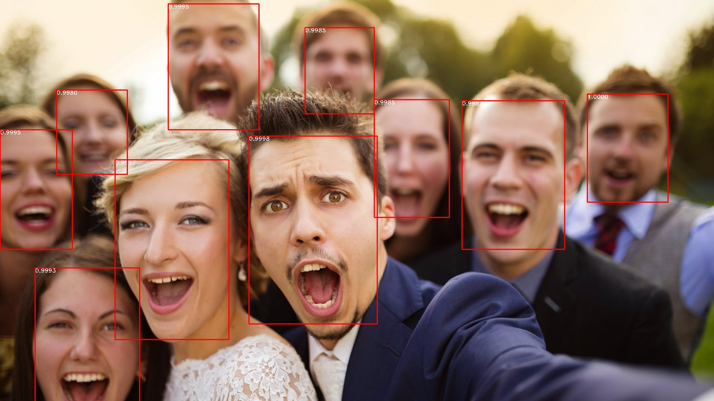

# FaceBoxes: A CPU Real-time Face Detector with High Accuracy

 [](https://github.com/yakhyo/faceboxes-pytorch)

https://arxiv.org/abs/1708.05234

FaceBoxes is a high-performance face detection model. This repository provides the code for performing face detection using the FaceBoxes model.

<div align="center">
    <!--  -->
    
</div>

## Table of Contents

- [Project Description](#project-description)
- [Installation](#installation)
- [Training](#training)
  - [Dataset Folder Structure](#dataset-folder-structure)
- [Testing](#testing)
- [Usage](#usage)
- [Contributing](#contributing)
- [License](#license)
- [Reference](#reference)

## Project Description

FaceBoxes is a high-performance, real-time face detection model specifically designed for efficient and accurate face detection on CPUs. The model architecture is optimized for speed, making it suitable for applications that require quick and reliable face detection without the need for powerful GPUs.

Following updates have been made so far:

- [x] Re-written the training code and model architecture.
- [x] Pre-trained weights and checkpoint file are available [here](https://github.com/yakhyo/faceboxes-pytorch/releases/tag/v0.0.1).
- [x] Made several auxiliary updates to the code.

To Do
- [] torch to onnx convert
- [] onnx inference

## Installation

1. **Clone the repository**:

```bash
git clone https://github.com/yakhyo/faceboxes-pytorch.git
cd faceboxes-pytorch
```

**To download pre-trained model weights**:
- Run below command:
  ```
  sh download.sh
  ```
- Download from [here](https://github.com/yakhyo/faceboxes-pytorch/releases/download/v0.0.1/faceboxes.pth)

2. **Install dependencies**:

    Create a virtual environment and install the required packages:

```bash
conda create -n faceboxes
conda activate faceboxes
pip install -r requirements.txt
```

    The `requirements.txt` should include the necessary libraries such as `torch`, `opencv-python`, `numpy`, etc.

## Training
1. Download WIDER_FACE dataset, place the images under this directory:
```
./data/WIDER_FACE/images
```

2. Convert WIDER FACE annotations to VOC format or download from [here](https://drive.google.com/file/d/1-s4QCu_v76yNwR-yXMfGqMGgHQ30WxV2/view), place them under this directory:
```
./data/WIDER_FACE/annotations
```

3. Train the model using WIDER_FACE train set data:
```bash
python train.py --train-data ./data/WIDER_FACE
```

`train.py` file arguments:
```
usage: train.py [-h] [--train-data TRAIN_DATA] [--num-workers NUM_WORKERS] [--num-classes NUM_CLASSES] [--batch-size BATCH_SIZE] [--epochs EPOCHS] [--print-freq PRINT_FREQ] [--learning-rate LEARNING_RATE]
                [--lr-warmup-epochs LR_WARMUP_EPOCHS] [--power POWER] [--momentum MOMENTUM] [--weight-decay WEIGHT_DECAY] [--gamma GAMMA] [--save-dir SAVE_DIR] [--resume]

Training Arguments for FaceBoxes Model

options:
  -h, --help            show this help message and exit
  --train-data TRAIN_DATA
                        Path to the training dataset directory.
  --num-workers NUM_WORKERS
                        Number of workers to use for data loading.
  --num-classes NUM_CLASSES
                        Number of classes in the dataset.
  --batch-size BATCH_SIZE
                        Number of samples in each batch during training.
  --epochs EPOCHS       max epoch for retraining.
  --print-freq PRINT_FREQ
                        Print frequency during training.
  --learning-rate LEARNING_RATE
                        Initial learning rate.
  --lr-warmup-epochs LR_WARMUP_EPOCHS
                        Number of warmup epochs.
  --power POWER         Power for learning rate policy.
  --momentum MOMENTUM   Momentum factor in SGD optimizer.
  --weight-decay WEIGHT_DECAY
                        Weight decay (L2 penalty) for the optimizer.
  --gamma GAMMA         Gamma update for SGD.
  --save-dir SAVE_DIR   Directory where trained model checkpoints will be saved.
  --resume              Resume training from checkpoint
```

### Dataset Folder Structure
```
data/|
     ├── AFW/
     │   ├── images/
     │   └── img_list.txt
     ├── FDDB/
     │   ├── images/
     │   └── img_list.txt
     ├── PASCAL/
     │   ├── images/
     │   └── img_list.txt
     └── WIDER_FACE/                 <= Used for training
         ├── annotations/
         ├── images/
         └── img_list.txt

```


## Testing

`test.py` file arguments:
```
usage: test.py [-h] [--weights WEIGHTS] [--save-dir SAVE_DIR] [--dataset {AFW,PASCAL,FDDB}] [--conf-threshold CONF_THRESHOLD] [--pre-nms-top-k PRE_NMS_TOP_K] [--nms-threshold NMS_THRESHOLD]
               [--post-nms-top-k POST_NMS_TOP_K] [--show-image] [--vis-threshold VIS_THRESHOLD]

Testing Arguments for FaceBoxes Model

options:
  -h, --help            show this help message and exit
  --weights WEIGHTS     Path to the trained model state dict file.
  --save-dir SAVE_DIR   Directory to save the detection results.
  --dataset {AFW,PASCAL,FDDB}
                        Select the dataset to evaluate on.
  --conf-threshold CONF_THRESHOLD
                        Minimum confidence threshold for considering detections.
  --pre-nms-top-k PRE_NMS_TOP_K
                        Number of top bounding boxes to consider for NMS.
  --nms-threshold NMS_THRESHOLD
                        Non-maximum suppression threshold.
  --post-nms-top-k POST_NMS_TOP_K
                        Number of top bounding boxes to keep after NMS.
  --show-image          Display detection results on images.
  --vis-threshold VIS_THRESHOLD
                        Visualization threshold for bounding boxes
```

Example run command:
```
python test --weights ./weights/faceboxes.pth --dataset PASCAL
```
It creates a folder with `eval`  name and stores there detection results in a text file.

## Usage

To inference on a single image:
```
python detecty.py --weights ./weights/faceboxes.pth --image-path sample.jpg
```
Resulting file will be saved under `./results` folder.

## Contributing

Contributions to improve the FaceBoxes Model are welcome. Feel free to fork the repository and submit pull requests, or open issues to suggest features or report bugs.

## License

The project is licensed under the [MIT license](https://opensource.org/license/mit/).


## Reference
The project is built on top of [FaceBoxes.PyTorch](https://github.com/zisianw/FaceBoxes.PyTorch). Model architecture and training strategy have been re-written for better performance.
